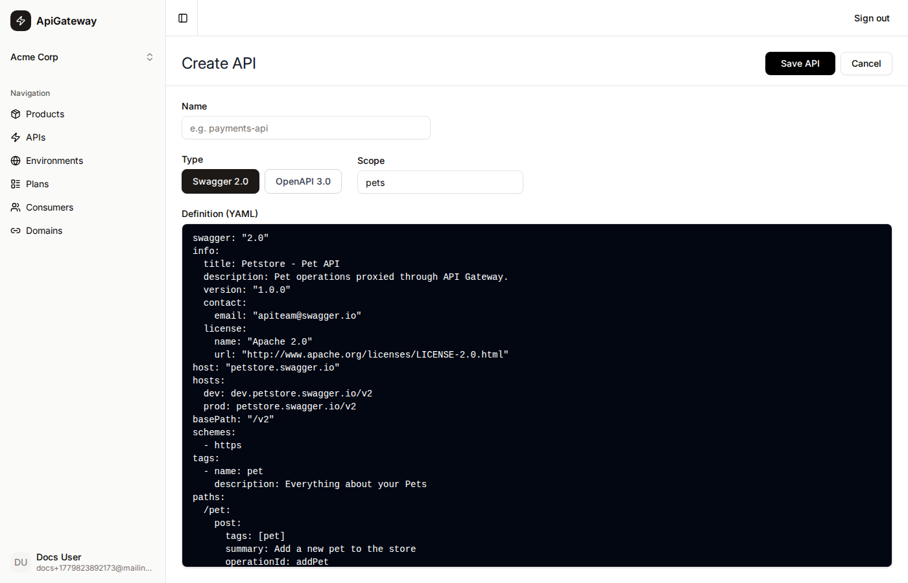
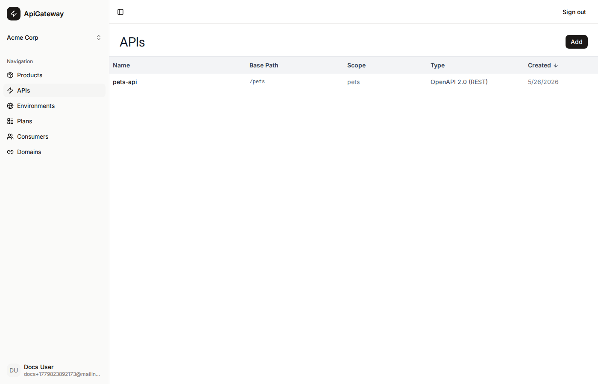
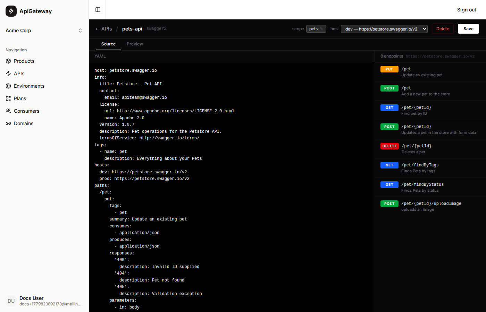
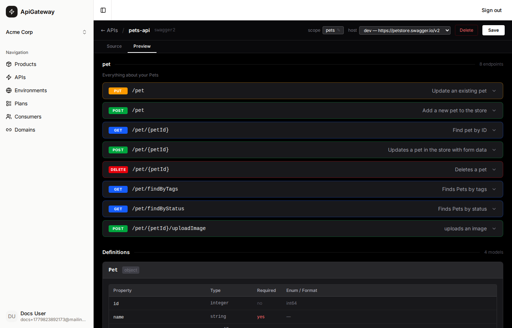

# API

An **API** represents a single REST service you want to manage through the portal. It stores your OpenAPI specification (Swagger 2.0 or OpenAPI 3.0), keeps it in sync with AWS API Gateway, and controls how the gateway routes requests to your backend.

## What an API is

When you create an API you provide:

- **Name** — a machine-friendly identifier (e.g. `payments-api`). Used as the AWS REST API title and as the resource-server name in Cognito.
- **Spec** — a full OpenAPI/Swagger YAML document (see [Spec format](#spec-format)).
- **Scope** — a short OAuth 2.0 scope string (e.g. `payments`). Every endpoint in this API will require the caller to hold a token with this scope.

The portal derives the **base path** automatically from `basePath` (Swagger 2.0) or the first `servers[].url` path (OpenAPI 3.0). Each API within an organisation must have a unique base path.

## Spec format

The spec you paste is a standard OpenAPI 2.0 or 3.0 YAML document with one custom extension field: **`hosts`**.

```yaml
swagger: "2.0"
info:
  title: Pets API
  version: "1.0.0"
host: petstore.swagger.io
hosts:
  dev: dev.petstore.swagger.io/v2
  prod: petstore.swagger.io/v2
basePath: "/v2"
paths:
  /pet/{petId}:
    get:
      summary: Find pet by ID
      parameters:
        - name: petId
          in: path
          required: true
          type: integer
      responses:
        "200":
          description: OK
```

The standard `host` / `servers` field is kept for documentation purposes. The custom `hosts` map tells the portal which real backend URL to use for each **Environment** when the product is published.

### The `hosts` field

```yaml
hosts:
  <environment-name>: <host>/<path-prefix>
```

- Keys are the environment names you create in the portal (e.g. `dev`, `staging`, `prod`).
- Values are `host/path` strings **without** the `https://` protocol (e.g. `api.example.com/v2`). The protocol is always HTTPS.
- At publish time the portal reads the value for the target environment and writes it to the AWS stage variable `backendHost`.
- The AWS integration URI for every endpoint becomes `https://${stageVariables.backendHost}<path>`.

This lets a single API definition serve multiple environments by just changing the stage variable — no spec changes needed between deploys.

## Proxy-only integration

All endpoints are wired as **HTTP_PROXY** integrations. The gateway forwards the full request (path, query string, headers, body) to your backend unchanged and streams the response back to the caller. There is no request or response mapping.

If your backend is behind a VPC or load balancer, point the `hosts` value at the public hostname or a Network Load Balancer endpoint that is reachable from API Gateway over the internet.

> **Only HTTP proxy is supported.** Lambda integrations, VPC Link (private), mock integrations, and request/response mappings are not supported.

## Scope

The **Scope** field on an API maps to an OAuth 2.0 resource-server scope in Cognito. Every endpoint in the API is automatically protected with two security requirements:

1. `x-api-key` — the caller must send their AWS API key in the `x-api-key` header.
2. `CognitoAuth` — the caller must send a valid JWT access token in the `Authorization` header that includes the scope `<api-name>/<scope>` (e.g. `payments-api-24/payments`).

When a consumer is provisioned, the portal creates a Cognito machine client with exactly the scopes belonging to the product's APIs. This means a consumer can only call the APIs in their assigned product.

## AWS sync

Every time you save an API the portal:

1. Builds an AWS-compatible spec by injecting `x-amazon-apigateway-integration` blocks for every path/method.
2. Adds the `api_key` and `CognitoAuth` security schemes.
3. Calls `PUT /restapis/{id}` (update) or `POST /restapis?failonwarnings=true&mode=import` (first save) on AWS API Gateway.
4. Stores the returned `awsApiId` on the API record.

The `hosts` field is stripped before the spec is sent to AWS; it is only used by the portal at publish time.

## Creating an API

Click **Add** on the APIs list page to open the create form. Provide a name, choose the spec type (Swagger 2.0 or OpenAPI 3.0), set the scope, and paste your YAML.



## API listing

The APIs page shows all APIs in your organisation as a table. Each row is clickable and navigates to the detail page.



| Column    | Description |
|-----------|-------------|
| Name      | The display name of the API |
| Base Path | The URL base path extracted from the spec (e.g. `/v2`) |
| Scope     | The OAuth scope assigned to the API |
| Type      | OpenAPI 2.0 (REST) or OpenAPI 3.0 (REST) |
| Created   | Date the API was created |

## API detail page

Clicking a row opens the API detail page. The page has two tabs:

### Source tab

The YAML editor shows the raw spec. Edit directly and click **Save** to push changes to AWS.

- The **scope** badge in the header is editable — click the pencil to change it.
- The **host** dropdown shows the environments derived from the `hosts` field in the spec and the URL that will be used for each. Selecting a host previews which backend the selected environment points to.



### Preview tab

A read-only rendered view of the spec showing all endpoints grouped by tag, with parameter tables and response codes.



## Deleting an API

An API can only be deleted when it is not associated with any Product. Open the detail page and click **Delete** — a confirmation dialog will appear. Deletion removes the AWS REST API and the database record.
