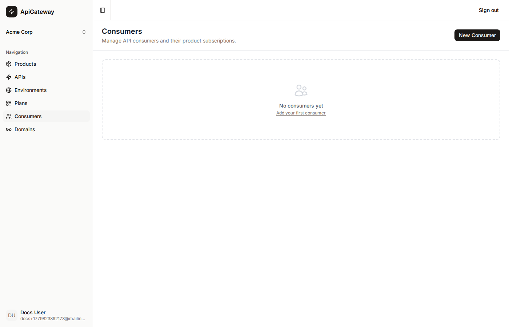

# Consumer

A **Consumer** is an application or service that has been provisioned to call a product's APIs. Creating a consumer triggers a sequence of AWS operations that produce the credentials the calling application needs.

## What a consumer is

A consumer represents one client that is authorised to call a specific product in a specific environment under a specific plan. It holds:

| Field           | Description |
|-----------------|-------------|
| Name            | A human-readable identifier for the client application |
| Product         | The product (bundle of APIs) this consumer can call |
| Environment     | The deployment stage (e.g. `prod`) this consumer targets |
| Plan            | The usage plan that limits this consumer's request rate |
| Client ID       | The Cognito App Client ID for obtaining OAuth tokens |
| Token URL       | The Cognito token endpoint for the `client_credentials` grant |
| AWS API Key ID  | The internal ID of the API Gateway API key |

The consumer stores credentials pointers, not the secrets themselves. The actual client secret and API key value are fetched on demand from AWS (see [Try Out](tryout.md)).

## Provisioning flow

When you create a consumer the portal performs these steps in order:

1. **Ensure resource servers** — for each API in the product, creates (or confirms) a Cognito resource server with the API's scope.
2. **Create Cognito App Client** — a machine-to-machine client with `client_credentials` grant and the scopes for all APIs in the product. The scope format is `<api-name>/<scope>` (e.g. `payments-api-24/payments`).
3. **Resolve token URL** — reads the Cognito hosted UI token endpoint for the user pool.
4. **Create AWS API key** — creates an API Gateway API key named after the consumer.
5. **Associate key with usage plan** — calls `POST /usageplans/{id}/keys` and enables the key on each API stage in the target environment.
6. **Save to database** — records `clientId`, `awsApiKeyId`, and `tokenUrl` on the consumer record.

If any AWS step fails the database record is not created and the user can retry.

## Consumers page

The Consumers page lists all consumers as a table. Click a row to open the detail page.



## Consumer detail page

The detail page has two tabs: **Details** and **Try Out**.

### Details tab

Shows and allows editing of the consumer's name, product, environment, and plan. Editing does not re-provision AWS resources — it only updates the database record.

Click **Delete** to remove the consumer. Deletion:
1. Deletes the Cognito App Client (AWS).
2. Deletes the API Gateway API key (AWS).
3. Removes the database record.

If either AWS deletion fails the database record is preserved so you can retry.

### Try Out tab

See [Try Out](tryout.md).

## Relationship to other resources

```
Consumer
  ├─ Product       (which product this consumer can call)
  ├─ Environment   (which stage to target)
  └─ Plan          (rate limits applied to this consumer's API key)
```

A consumer cannot be created for a product that has not yet been published to the target environment — the invoke URL must exist before provisioning.
