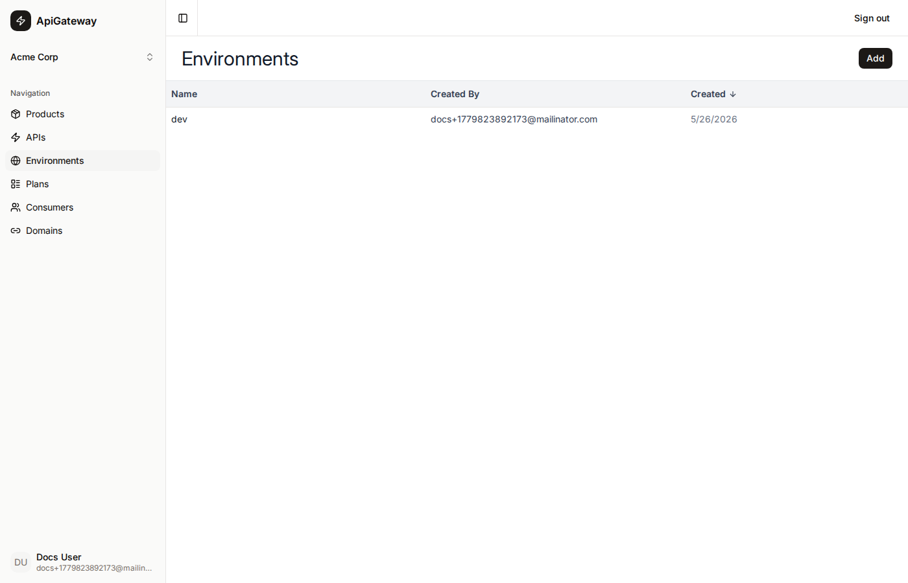

# Environment

An **Environment** is a named deployment target such as `dev`, `staging`, or `prod`. Environments are organisation-level resources that are shared across all products and APIs in your organisation.

## What an environment is

An environment is a simple named label. The meaningful work happens when:

1. **Publishing a product** — the portal creates or updates one AWS API Gateway stage per API in the product, naming the stage after the environment. It also reads the `hosts` entry for that environment from each API's spec and writes the backend URL into the stage variable `backendHost`.
2. **Creating a consumer** — the consumer is linked to a specific environment. The consumer's API key and OAuth scopes are granted access to the stage for that environment.

A product can be published to multiple environments independently, creating a separate invoke URL per environment.

## Environments page

The Environments page lists all environments for the active organisation. Use the **Add** button in the top-right to create a new environment.



| Column     | Description |
|------------|-------------|
| Name       | The environment name (also used as the AWS stage name) |
| Created By | Email of the user who created it |
| Created    | Date of creation |

## Creating an environment

Click **Add**, type a name (lowercase, no spaces — it becomes an AWS stage name), and click **Create**. The environment is saved to the database only; no AWS resources are created until a product is published to it.

## Deleting an environment

Inline row-level delete is available directly on the Environments page (environments are exempt from the standard detail-page-only delete pattern). A product deployment or consumer linked to this environment must be removed first.

## Relationship to other resources

```
Environment
  └─ referenced by Product Deployments  (product published to this env)
  └─ referenced by Consumers            (consumer scoped to this env)
```

The environment name must match a key in the `hosts` map of every API spec that gets published to it. If the spec has no entry for the environment name, the stage variable `backendHost` will be empty and requests will fail.
