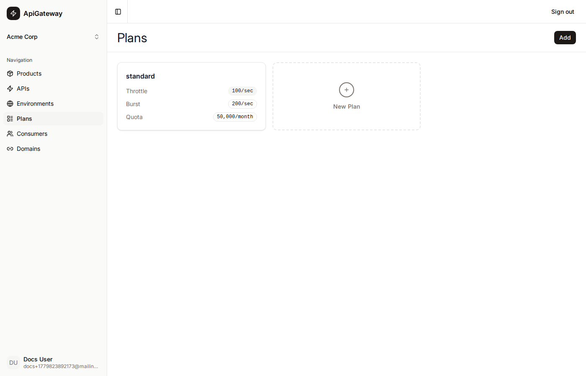

# Plan

A **Plan** defines the rate limits and quota that apply to a consumer. It maps directly to an AWS API Gateway **Usage Plan**.

## What a plan is

Plans are organisation-level resources that set the ceiling on how much traffic a single consumer is allowed to send. Every consumer must be assigned exactly one plan when it is created.

A plan has three configurable limits — all are optional:

| Field        | AWS concept         | Description |
|--------------|---------------------|-------------|
| Throttle     | Throttle rate       | Steady-state requests per second |
| Burst        | Throttle burst      | Maximum instantaneous requests per second above the throttle rate |
| Quota limit  | Quota limit         | Maximum total requests per quota period |
| Quota period | Quota period        | The window for the quota: Day, Week, or Month |

Leave a field blank to apply no limit for that dimension.

## AWS sync

When you create or update a plan the portal immediately syncs it to AWS as a Usage Plan. The `awsUsagePlanId` is stored on the plan record and used when associating new consumer API keys with this plan.

When a consumer is provisioned with a plan, the portal calls `POST /usageplans/{id}/keys` to associate the consumer's API key with the plan and enables the key on each published API stage.

## Plans page

The Plans page displays all plans for the active organisation as cards. Use the **Add** button to create a new plan, or click an existing card to edit it inline.



Each card shows:
- Plan name
- Throttle (requests/sec)
- Burst (requests/sec)
- Quota (requests/period)

## Creating a plan

Click **Add** (or the dashed **New Plan** card), fill in the name and any limits, and click **Create**. The plan is saved to the database and synced to AWS simultaneously.

## Editing a plan

Click an existing plan card to open the edit form inline. Changes are synced to the existing AWS Usage Plan.

## Deleting a plan

A plan cannot be deleted while any Product has it associated. Remove the plan from all products first, then delete it. Deletion removes the AWS Usage Plan and the database record.

## Relationship to other resources

```
Plan  (→ AWS Usage Plan)
  └─ associated with Products  (plan_associations)
  └─ assigned to Consumers     (limits apply per consumer API key)
```
