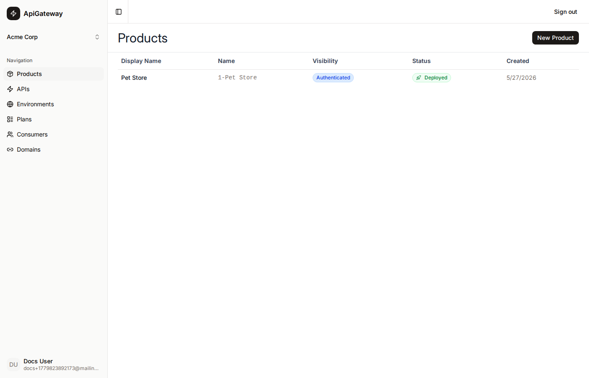
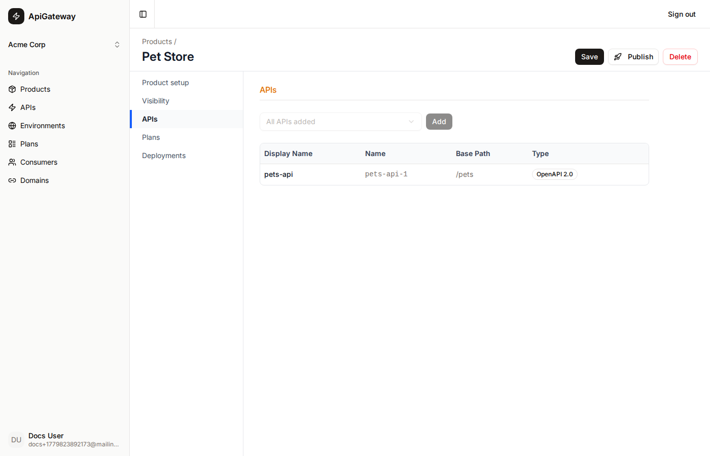
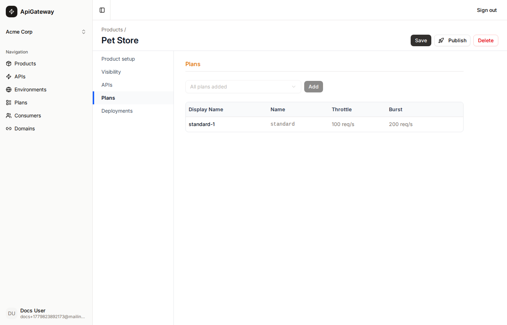
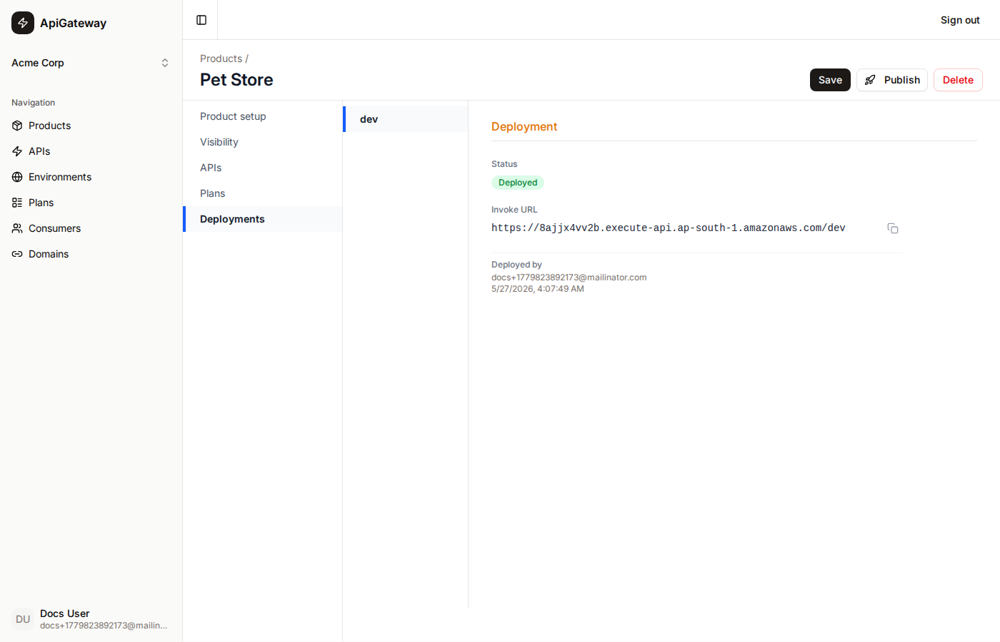

# Product

A **Product** is a bundle of APIs and Plans that you publish to one or more environments and then hand to consumers. It is the central organising unit — everything that a consumer can call is scoped to the product they are assigned.

## What a product is

A product groups together:

- **APIs** — one or more APIs whose endpoints will be accessible to consumers of this product.
- **Plans** — one or more usage plans that can be chosen when creating a consumer.

A consumer is always tied to a specific product + environment + plan combination.

## Publishing a product

Publishing deploys the product to a target environment. The portal:

1. Reads all APIs associated with the product that have been synced to AWS (`awsApiId` is set).
2. For each API, creates or updates an AWS API Gateway **Stage** named after the environment.
3. Sets the `backendHost` stage variable to the value from the API spec's `hosts` map for that environment.
4. Records the resulting `invoke_url` (e.g. `https://abc123.execute-api.ap-south-1.amazonaws.com/prod`) in the `product_deployments` table.

The invoke URL is later used by the Try Out sandbox and is shown in the deployments section of the product detail page.

A product can be published to multiple environments. Each publish creates or refreshes the deployment for that environment independently.

## Products page

The Products page lists all products as a table. Click a row to open the detail page.



## Product detail page

The detail page is where you manage the product's API associations, plan associations, and deployments. A left-hand nav switches between sections.

### APIs section

Add or remove APIs from the product. The dropdown lists all available APIs in the organisation. Changes are saved atomically on **Save**.



### Plans section

Add or remove Plans from the product. Consumers will choose from these plans when they are created.



### Deployments section

Shows each environment the product has been published to, the live invoke URL, the deployer, and the last deploy date.



### Header actions

- **Save** — persists the current API/plan associations to the database (no AWS call).
- **Publish** — opens a dialog to select an environment and deploy. Calls AWS API Gateway to create/update stages.
- **Delete** — removes the product. Cannot delete while any consumers are linked to it.

## Visibility

Products have a `visibility` field (`authenticated` by default). This is metadata only — all endpoints are always protected by the Cognito authorizer regardless of visibility.

## Relationship to other resources

```
Product
  ├─ API Associations      (which APIs are in this product)
  ├─ Plan Associations     (which Plans consumers can choose)
  ├─ Product Deployments   (environments this product has been published to + invoke URLs)
  └─ Consumers             (consumers created against this product)
```
