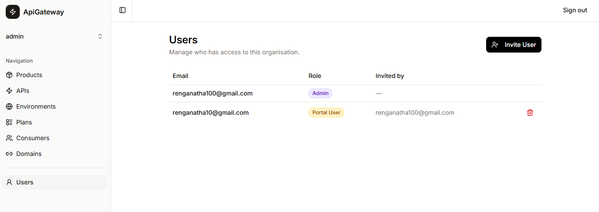

# Users & Access Control

The Users page lets organisation admins invite colleagues and assign roles that control what each person can see and do inside the portal.



---

## Inviting a user

1. Click **Invite User** in the top-right corner.
2. Enter the invitee's email address and choose their role.
3. Submit the form.

What happens under the hood:

- The portal calls `AdminCreateUser` on your Cognito User Pool with `SUPPRESS` message delivery (no Cognito welcome email).
- Cognito creates the account in a `FORCE_CHANGE_PASSWORD` state.
- A row is inserted into `organisation_members` in the database, linking the email to this organisation with the selected role.

The invitee receives no automated email at this stage — you share the portal URL and their temporary credentials yourself.

---

## First login — setting a password

When an invited user logs in for the first time Cognito returns a `NEW_PASSWORD_REQUIRED` challenge instead of tokens. The portal detects this and redirects the user to a **Set Password** screen where they choose a permanent password.

```
Login attempt
  └─ Cognito responds: NEW_PASSWORD_REQUIRED challenge
       └─ Portal stores challenge session in cookie
            └─ Redirect → /set-password
                 └─ User submits new password
                      └─ Portal calls RespondToAuthChallenge
                           └─ Cognito issues access + refresh tokens
                                └─ User is logged in, redirected to home
```

After this one-time step the user logs in normally with their chosen password on every subsequent visit.

---

## Roles

Roles are scoped **per organisation**. The same email address can be an `admin` in one organisation and a `viewer` in another. This is why roles live in the `organisation_members` database table rather than as Cognito user attributes.

Cognito user attributes are global to the user pool — there is no built-in way to attach per-organisation metadata to them. Storing roles in the database gives each organisation its own independent access policy and keeps the data exactly where it can be queried, joined, and audited alongside the resources it protects.

### Role reference

| Role | Who it's for |
|------|-------------|
| **Admin** | Organisation owners. Full access including inviting users and managing all resources. |
| **Editor** | Team members who build and maintain APIs, products, and consumers. Cannot invite users. |
| **Viewer** | Read-only stakeholders — can browse everything but cannot create, edit, delete, publish, or invite. |
| **Portal User** | External consumer developers. Sees only the Consumers section; cannot see APIs, products, plans, environments, or domains. |

### Permission matrix

| Permission | Admin | Editor | Viewer | Portal User |
|------------|:-----:|:------:|:------:|:-----------:|
| View APIs, Products, Environments, Plans, Domains | ✓ | ✓ | ✓ | — |
| View Consumers | ✓ | ✓ | ✓ | ✓ |
| View Users page | ✓ | ✓ | ✓ | — |
| Create resources | ✓ | ✓ | — | — |
| Edit resources | ✓ | ✓ | — | — |
| Delete resources | ✓ | ✓ | — | — |
| Publish products | ✓ | ✓ | — | — |
| Create / manage consumers | ✓ | ✓ | — | ✓ |
| Invite users | ✓ | — | — | — |

---

## How permissions drive the UI

### Sidebar navigation

The sidebar filters its links based on the active role. Portal users see only **Consumers**; all other authenticated roles see the full navigation tree. The **Users** link appears only for admin, editor, and viewer.

### Create buttons and empty states

On list pages (APIs, Products, Environments, Plans, Consumers, Domains), the **New / Add** button and any empty-state "Create your first …" prompts are hidden when the user lacks the `create:resources` (or `manage:consumers` for the Consumers page) permission. Viewers and portal users never see these affordances.

### Create route redirection

If a user navigates directly to a creation URL (e.g. `/apis/new`) without the required permission — whether via a bookmarked link or a client-side navigation — the route's loader detects the missing permission and immediately redirects back to the corresponding list page. This guard runs on both the server (direct URL visit, page refresh) and the client (React Router navigation), so there is no moment where the form renders and then disappears.

### Action buttons on detail pages

Save, Publish, and Delete buttons on detail pages are rendered inside `<Can permission="...">` wrappers. A viewer who opens a detail page sees the data but no action buttons.

### Enforced on the server

UI hiding is a convenience — the real enforcement is in every route's `action` function. Each action calls `requirePermission(request, orgId, permission)` before doing any work. If the permission check fails it returns a `403 Forbidden` response regardless of how the request arrived.

---

## Removing a user

Click the red trash icon on a member's row to remove them from the organisation. If that was their **only** organisation, the portal also deletes the Cognito account so the email address is fully freed. If the user belongs to other organisations their Cognito account is preserved.

The database row is removed only after AWS cleanup succeeds. If the Cognito deletion fails for any reason, the member record is kept intact and the error is logged server-side, so you can retry.

---

## Role caching

Checking the database on every single request to resolve the active user's role would add latency. The portal avoids this by caching the active `(organisationId, role)` pair in the encrypted session cookie:

- **Written** when the user switches organisation or when the layout loader refreshes it from the database at the start of each navigation.
- **Read** by `requirePermission` before touching the database — the DB is only hit if the session cache is empty (e.g. first request after login).
- **Invalidated** automatically when the organisation changes via the org-switcher, which writes both the new org ID and the new role atomically.

This means a role change takes effect for the affected user on their next full page navigation, not instantly mid-session.
